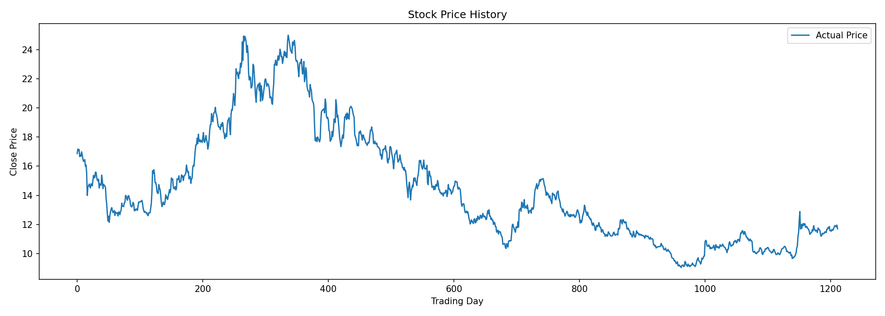
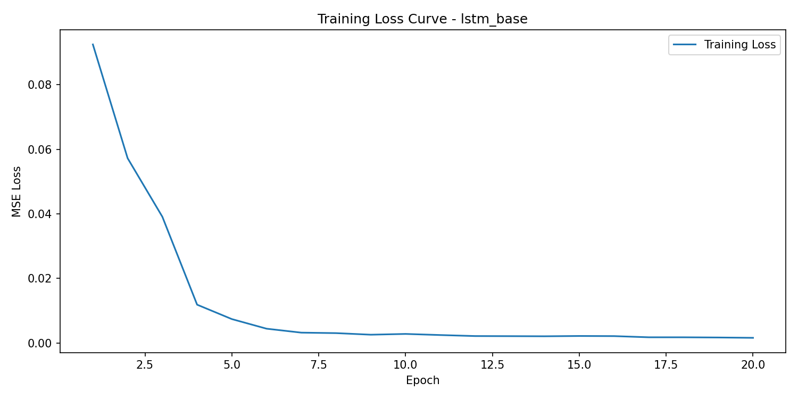
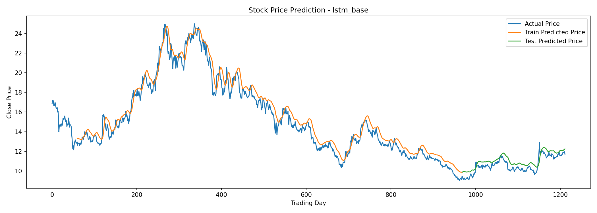
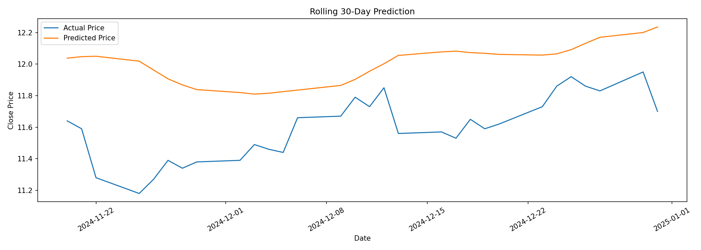

# 股票价格预测项目报告

## 1. 项目目标和背景介绍
本项目主要使用 PyTorch 搭建 LSTM 模型，利用股票历史收盘价预测下一交易日的收盘价，并观察模型在时间序列预测任务中的表现。股票价格数据本身具有时间顺序，因此比较适合用 LSTM 这类模型来处理。

## 2. 数据获取和预处理过程

本项目优先使用 `akshare` 获取数据，如果接口不可用，再使用 `yfinance` 作为备用数据源。
- 股票代码：000001
- 数据区间：20200101 至 20250101
- 使用特征：收盘价
- 时间窗口：前 60 个交易日预测后 1 个交易日（或者说“用过去 60 天预测后 1 天”）模型每次输入的是一段连续的价格序列。

数据划分时，前 80% 的样本用于训练，后 20% 的样本用于测试。因为股票数据有时间顺序，所以不能随机打乱。
归一化时先用训练集数据拟合 `MinMaxScaler`，再将同一个缩放规则应用到全部数据上，这样可以避免测试集信息提前泄漏到训练过程中。

## 3. 模型架构设计和参数选择
本项目使用了两层 LSTM 和两层全连接层来预测下一交易日的收盘价。

模型流程：将过去 60 天的收盘价序列输入模型，先经过第一层 LSTM 提取时序特征，再经过第二层 LSTM 进一步提取特征，然后取最后一个时间步的输出，送入两层全连接层，最终输出 1 个值，作为下一交易日的预测收盘价。

主要参数如下：
- hidden_size：50
- 全连接层：50 -> 25 -> 1
- 损失函数：MSELoss
- 优化器：Adam
- 训练轮数：20
- Batch Size：64
- 学习率：0.001

## 4. 训练过程和结果分析
从训练过程来看，模型可以学习到一定的价格变化规律。训练初期损失下降比较快，后期下降速度变慢，说明模型逐渐趋于稳定。

从预测结果图可以看出，模型对整体走势有一定跟随能力，但预测曲线会比真实价格更平滑，对短期波动和突然变化的反应不够敏感。
这说明只使用收盘价作为单一特征时，模型的表达能力是有限的。

历史价格图如下：

损失曲线图如下：

训练集和测试集预测效果图如下：

## 5. 模型性能评估
训练集指标如下：
- MSE：0.6550
- RMSE：0.8093
- MAE：0.6712

测试集指标如下：
- MSE：0.3023
- RMSE：0.5498
- MAE：0.5039

通过这些指标可以看出模型存在一定预测误差，其中 RMSE 能比较直观地反映预测值和真实值之间的偏差。整体来看，模型在测试集上可以给出一定的趋势判断，但误差仍然比较明显。

## 6. 不同模型架构的比较
本项目另外训练了一个隐藏层更大、并加入 dropout 的模型进行比较，结果如下：

- `lstm_base`：hidden_size=50，dropout=0.00，测试集 MSE=0.3023，RMSE=0.5498，MAE=0.5039
- `lstm_hidden64_dropout`：hidden_size=64，dropout=0.20，测试集 MSE=0.3015，RMSE=0.5491，MAE=0.4049

从结果来看，改进模型在 MSE 和 RMSE 上提升不算明显，但 MAE 更低，说明平均绝对误差有所下降，整体表现略好一些。

## 7. 最近30个交易日滚动预测结果
本项目选取最近 90 个交易日数据，用前 60 天预测第 1 天，再用后移 1 天的真实窗口继续预测下 1 天，一共得到最近 30 个交易日的滚动预测结果。

最近 30 个交易日滚动预测图如下：

最近 30 个交易日滚动预测结果如下：

|序号|实际收盘价|预测收盘价|
|--- |---------|---------|
| 1  | 11.0400 | 11.4712 |
| 2  | 10.9900 | 11.4800 |
| 3  | 10.6800 | 11.4827 |
| 4  | 10.5800 | 11.4533 |
| 5  | 10.6700 | 11.3985 |
| 6  | 10.7900 | 11.3438 |
| 7  | 10.7400 | 11.3058 |
| 8  | 10.7800 | 11.2764 |
| 9  | 10.7900 | 11.2584 |
| 10 | 10.8900 | 11.2494 |
| 11 | 10.8600 | 11.2553 |
| 12 | 10.8400 | 11.2661 |
| 13 | 11.0600 | 11.2765 |
| 14 | 11.0700 | 11.3061 |
| 15 | 11.1900 | 11.3443 |
| 16 | 11.1300 | 11.3949 |
| 17 | 11.2500 | 11.4419 |
| 18 | 10.9600 | 11.4925 |
| 19 | 10.9700 | 11.5141 |
| 20 | 10.9300 | 11.5185 |
| 21 | 11.0500 | 11.5091 |
| 22 | 10.9900 | 11.5040 |
| 23 | 11.0200 | 11.4965 |
| 24 | 11.1300 | 11.4914 |
| 25 | 11.2600 | 11.4981 |
| 26 | 11.3200 | 11.5227 |
| 27 | 11.2600 | 11.5607 |
| 28 | 11.2300 | 11.5969 |
| 29 | 11.3500 | 11.6258 |
| 30 | 11.1000 | 11.6589 |

这一部分使用的每个输入窗口都来自真实历史数据。图中同时展示了最近 30 个交易日的真实收盘价和预测收盘价，便于直接比较预测效果。结合图和表可以看出，模型能够给出一定趋势判断，但预测值整体偏高，与真实值仍然存在比较明显的差距。

## 8. 项目遇到的挑战和解决方案
- 数据接口会受到网络环境和库版本影响，因此代码中保留了备用数据源，避免单一接口失效后无法继续实验。
- 股票价格范围较大，直接训练效果不稳定，因此先对数据做归一化处理。
- 一开始我把第 7 部分理解成递归预测，也就是把上一步预测值继续作为下一步输入。后来和老师交流后，我改成了基于真实历史窗口的滚动预测方式，使这部分逻辑与老师后续说明保持一致。

## 9. 可能的改进方向
- 增加更多特征，如开盘价、最高价、最低价、成交量等
- 尝试更多模型，如 GRU、Transformer
- 增加验证集，对参数进行进一步调整

## 10. 个人学习收获和体会
通过这个项目，我对时间序列预测的基本流程有了更完整的理解，包括数据获取、数据预处理、模型搭建、模型训练和结果评估。同时，我也进一步熟悉了 PyTorch 和 LSTM 的基本使用方法。这个项目让我认识到，股票价格预测本身比较复杂，模型结果更适合作为学习和研究参考，不能直接作为投资依据。
